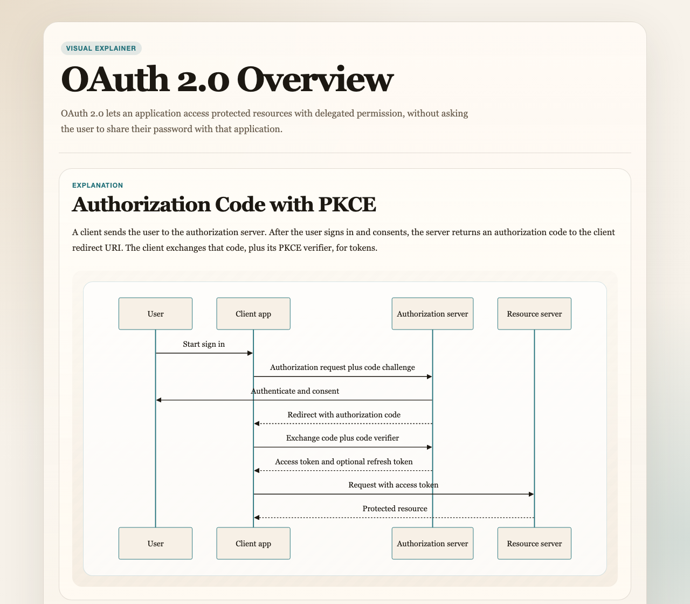

# Visual Explaining Skill

An open-source LLM skill for generating a single local HTML explainer for a codebase, module, feature, fix, or recent implementation.

The generated HTML can mix prose, file notes, callouts, lists, and Mermaid diagrams. Mermaid renders in the browser, so the skill does not require a local Mermaid renderer.

## Preview

[](examples/oauth-2-overview.html)

Example artifact: [`examples/oauth-2-overview.html`](examples/oauth-2-overview.html)

## Structure

The installable skill lives in `skills/visual-explaining/`:

```text
visual-explaining-skill/
├── README.md
├── LICENSE
├── package.json
├── examples/
│   ├── oauth-2-overview.html
│   └── oauth-2-overview.png
└── skills/
    └── visual-explaining/
        ├── SKILL.md
        ├── agents/
        │   └── openai.yaml
        ├── assets/
        │   └── visual-explainer.html
        ├── references/
        │   └── html-layouts.md
        └── scripts/
            └── render-html.js
```

## Contents

- `skills/visual-explaining/SKILL.md` - the skill instructions agents should load.
- `skills/visual-explaining/agents/openai.yaml` - optional UI metadata for Codex-style skill lists.
- `skills/visual-explaining/scripts/render-html.js` - the helper that renders an explainer spec into HTML.
- `skills/visual-explaining/assets/visual-explainer.html` - the browser-rendered HTML template.
- `skills/visual-explaining/references/html-layouts.md` - layout and spec examples for agents.

## Requirements

- Node.js 20 or newer.
- A browser with network access for Mermaid and PNG export dependencies loaded from jsDelivr.

## Install

Clone this repository first:

```bash
git clone https://github.com/TaiNgo6798/visual-explaining-skill.git
cd visual-explaining-skill
```

Then copy `skills/visual-explaining/` into the skill directory for your LLM tool.

### Codex

User-level install:

```bash
mkdir -p ~/.codex/skills
cp -R skills/visual-explaining ~/.codex/skills/
```

Restart Codex, then ask: `Use $visual-explaining to give me a visual overview of this repo.`

### Claude Code

User-level install:

```bash
mkdir -p ~/.claude/skills
cp -R skills/visual-explaining ~/.claude/skills/
```

Project-level install:

```bash
mkdir -p .claude/skills
cp -R skills/visual-explaining .claude/skills/
```

Restart Claude Code, then ask: `Use visual-explaining to explain this module.`

### Gemini CLI

User-level install:

```bash
mkdir -p ~/.gemini/skills
cp -R skills/visual-explaining ~/.gemini/skills/
```

Project-level install:

```bash
mkdir -p .gemini/skills
cp -R skills/visual-explaining .gemini/skills/
```

In Gemini CLI, run `/skills reload` or restart the session. You can check discovery with `/skills list`.

### OpenCode

User-level install:

```bash
mkdir -p ~/.config/opencode/skills
cp -R skills/visual-explaining ~/.config/opencode/skills/
```

Project-level install:

```bash
mkdir -p .opencode/skills
cp -R skills/visual-explaining .opencode/skills/
```

Restart OpenCode so it can discover the new `SKILL.md`.

### Cursor

Project-level install:

```bash
mkdir -p .cursor/skills
cp -R skills/visual-explaining .cursor/skills/
```

Portable project install:

```bash
mkdir -p .agents/skills
cp -R skills/visual-explaining .agents/skills/
```

Reload the Cursor window, then invoke the skill from Agent chat with `/visual-explaining` or ask for a visual code overview.

## Manual Usage

```bash
cat <<'JSON' | node skills/visual-explaining/scripts/render-html.js --stdin --output ./visual-explainer.html
{
  "title": "Example Overview",
  "summary": "A short summary of the topic.",
  "sections": [
    {
      "heading": "Request Flow",
      "blocks": [
        { "type": "text", "text": "Requests enter through the API and move into the service layer." },
        { "type": "mermaid", "mermaid": "flowchart TD\n  Client --> API --> Service" }
      ]
    }
  ]
}
JSON
```

Open the generated HTML file in a browser. The page includes buttons to save the full explainer or individual sections as PNG images.

## License

MIT
